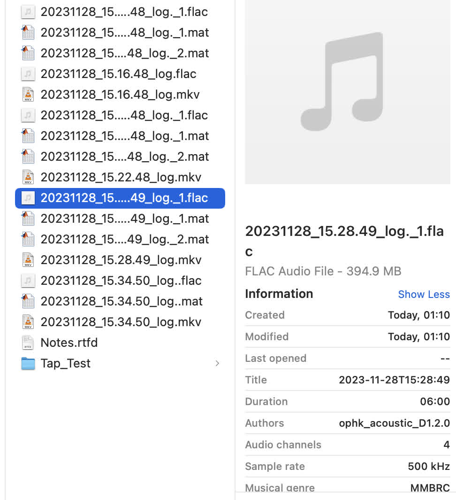
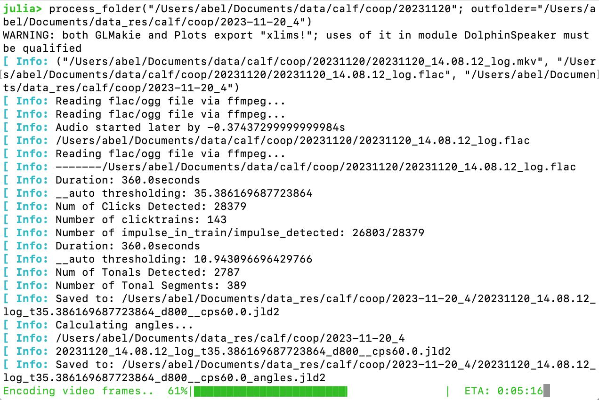

# Dolphin Speaker Localization
<!--- 
[](https://juliaci.github.io/PkgTemplates.jl/stable)
[](https://juliaci.github.io/PkgTemplates.jl/dev)
[](https://github.com/JuliaCI/PkgTemplates.jl/actions/workflows/CI.yml?query=branch%3Amaster)
[](https://codecov.io/gh/JuliaCI/PkgTemplates.jl)
[](https://github.com/invenia/BlueStyle)
[](https://github.com/SciML/ColPrac)

**PkgTemplates creates new Julia packages in an easy, repeatable, and customizable way.**
--->
## 1. Installation
### Install Julia runtime:  
https://julialang.org/downloads/  
https://julialang.org/downloads/platform

### Install this software with the Julia package manager [Pkg](https://pkgdocs.julialang.org/), just like any other registered Julia package:
1. start Julia software
1. Press "]" key
1.
```
add https://github.com/AbelHo/DolphinSpeaker.jl
```
4. to go back to normal mode, press "backspace"

## 2. Update software
1. Press "]" key
2.
```
update
```

## 3. Usage
### 3.1 Initialize
```
using DolphinSpeaker
```

### 4. Data Processing

#### 4.1 Convert .mat to .flac audio file
Format:
```
mat2flac(input_folderpath; outfilepath=output_folderpath)
```
Example:
```
mat2flac("/Users/abel/Documents/data/calf/Clicktest/20190913"; outfilepath="/Users/abel/Documents/data/calf/Clicktest/20190913/flac")
```

#### 4.2 Convert .bin to .flac audio file
Assumes Sampling Rate of _500kHz_ and _Float64/double_ precision data .bin binary file. 
Usage same as all the ```mat2flac``` examples, just change the command to ```bin2flac(...)``` & ```bin2flac_check(...)``` instead

#### 4.3 Change Audio File Metadata
Execute these commands to change the metadata parameter before running flac conversion
```
DolphinSpeaker.FILE_device_ID = "ophk_acoustic_D1.2.0"
```
```
DolphinSpeaker.FILE_location_ID = "MMBRC_pool2"
```
```
DolphinSpeaker.FILE_gain_setting = "0011"
```
##### 4.3.1 Example Audio File with Metadata


#### 4.4 Process and overlay one set of video and acoustic recording, provided to results directory/folder
format:
```
process_one_set(vidfname, aufname, res_dir)
```
Example:
```
process_one_set("/Users/abel/Documents/data/calf/Clicktest/20231129/20231129_15.20.54_log.mkv", "/Users/abel/Documents/data/calf/Clicktest/20231129/20231129_15.20.54_log.flac", "/Users/abel/Documents/data_res/calf/temp/test_laptop")
```

#### 4.5 Process entire folder automatically
format:
```
process_folder(foldername; outfolder=res_dir)
```
Example:
```
process_folder("/Users/abel/Documents/data/calf/Clicktest/20231129"; outfolder="/Users/abel/Documents/data_res/calf/temp")
```


### 5. Advance
#### 5.1 Display conversion error results clearly
```
mat2flac_check(input_folderpath; outfilepath=output_folderpath)
```

#### 5.2 Delete original input files(if conversion error is negligible)
```
mat2flac_check(input_folderpath; outfilepath=output_folderpath, remove_original=true)
```

#### 5.3 Convert to flac and output to the same filepath as input_folder
```
mat2flac_check(input_folderpath; outfilepath=:inplace)
```
1. Convert to flac and output to the same filepath as input_folder
2. Delete original input files(if conversion error is negligible)
```
mat2flac_check(input_folderpath; outfilepath=:inplace, remove_original=true)
```

#### 5.4 Changing Parameters
click threshold(eg: 4, default is 9):
```
DolphinSpeaker.impulsive_autothreshold_median_ratio = 4
```
frequency filter(eg: filtering to use only 5000Hz ~ 180,000Hz):
```
DolphinSpeaker.impulsive_band_pass = [5000, 180_000]
```

change settings for clicker detection:
```
DolphinSpeaker.set_device__hk_clicker()
```


