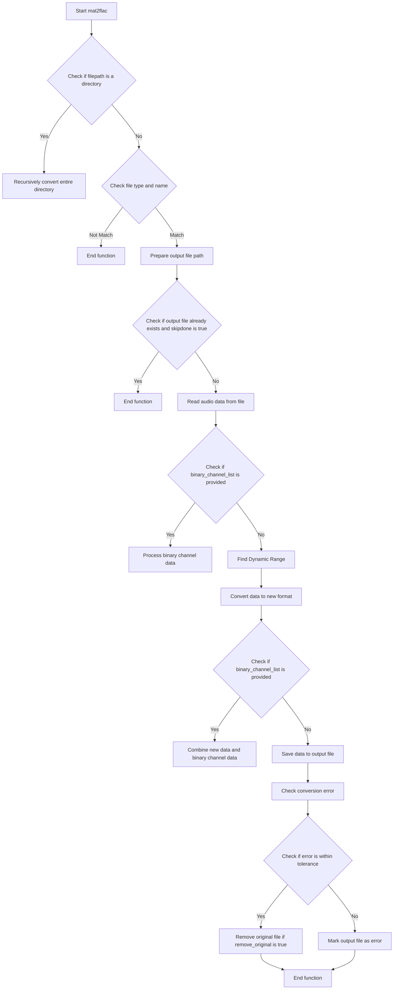

```mermaid
graph TD
    A[Start mat2flac] --> B{Check if filepath is a directory}
    B -->|Yes| C[Recursively convert entire directory]
    B -->|No| D{Check file type and name}
    D -->|Not Match| E[End function]
    D -->|Match| F[Prepare output file path]
    F --> G{Check if output file already exists and skipdone is true}
    G -->|Yes| H[End function]
    G -->|No| I[Read audio data from file]
    I --> J{Check if binary_channel_list is provided}
    J -->|Yes| K[Process binary channel data]
    J -->|No| L[Find Dynamic Range]
    L --> M[Convert data to new format]
    M --> N{Check if binary_channel_list is provided}
    N -->|Yes| O[Combine new data and binary channel data]
    N -->|No| P[Save data to output file]
    P --> Q[Check conversion error]
    Q --> R{Check if error is within tolerance}
    R -->|Yes| S[Remove original file if remove_original is true]
    R -->|No| T[Mark output file as error]
    S --> U[End function]
    T --> U
```