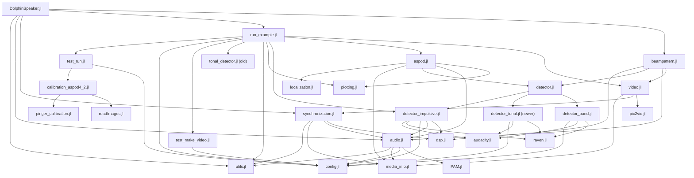
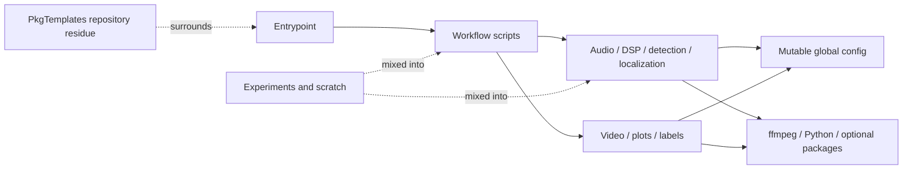

# Current repository map

This map describes the inspected working tree, including material that is
ignored or untracked. Sizes are approximate snapshots, not Git history.

## Physical layout

```text
DolphinSpeaker.jl/                         ~12 GB working directory
├── .github/                               PkgTemplates automation residue
├── .CondaPkg/                             ~3.7 GB, 54,681 files, UNTRACKED
├── docs/
│   ├── make.jl, Project.toml              PkgTemplates docs build
│   ├── src/{index,user,...}.md            PkgTemplates guides
│   ├── algorithm_description.md           Dolphin-specific/useful
│   └── overlay_*.md                       newer Dolphin-specific docs
├── results/                               ~759 MB, ignored outputs
├── temp/                                  ~7.1 GB, 43,768 files, ignored
├── templates/                             29 PkgTemplates template files
├── test/
│   ├── runtests.jl                        PkgTemplates runner
│   ├── fixtures/ + old test files         PkgTemplates suite (113 files total)
│   ├── test_overlay_annotations.jl         useful but unwired draft
│   ├── run_overlay_examples.jl             machine-specific runnable example
│   └── test_viterbi_ridge.jl              untracked current work
├── src/
│   ├── DolphinSpeaker.jl                  nominal package entry point
│   ├── audio/media/synchronization         active core
│   ├── detector*.jl                        active detection core + old duplicate
│   ├── dsp/localization/config             active domain core
│   ├── audacity/raven                      label adapters
│   ├── video/plotting/camera               visualization and camera work
│   ├── run_example/test_run/test_make_video workflow + production mixed together
│   ├── plugin/show/plugins/                PkgTemplates implementation residue
│   ├── analysis/dev/scratch/temp files     experiments mixed into package source
│   └── pinn/clustering files               untracked experiments
├── scripts/                               untracked PINN debugging scripts
├── Project.toml                           canonical package declaration, 73 deps
├── Manifest.toml                          current but ignored
├── Project_old.toml                       root-level legacy snapshot
├── Project_20250728.toml                  root-level legacy snapshot
├── Manifest_20250728.toml                 root-level legacy snapshot
├── README.md                              installs from #temp_commit
├── LICENSE                                imported PkgTemplates license text
├── CondaPkg.toml                          untracked, does not declare cuML
├── CUML_*.md                              untracked, claims more than config proves
└── test_cuml*                             untracked install/GPU experiments
```

The tracked tree has about 267 files and 1.55 MB of content. Approximate tracked
file counts by top-level area are: `test` 117, `src` 91, `templates` 29, root 12,
`docs` 9, and `.github` 5. File count therefore strongly overstates the amount
of DolphinSpeaker-specific testing.

## Current package include graph

This diagram intentionally simplifies leaf detail. A repeated arrow means a
source file includes another source file; it does not merely call its API.



Consequences visible in this graph:

- The dependency direction is not acyclic; high-level workflow and low-level
  implementation files repeatedly re-enter the same sources.
- `config.jl`, `audio.jl`, `utils.jl`, and detection files are evaluated many
  times in a single nominal package load.
- Files named as tests are part of production.
- Both the old and newer tonal detector enter the graph.
- `aspod.jl` mixes disabled notebook-like blocks with a late cluster of includes.

## Current conceptual layers



The active pipeline is coherent at the conceptual level. The problem is that
physical file placement and include mechanics do not enforce those boundaries.

## Branch and environment map

```text
master / origin/HEAD  9306007 (2024-04-10)
          |
          +---- 195 linear commits ---- temp_commit 621fe73 (2026-06-29)
                                      README installation target

Core Project.toml
  ├── ordinary audio/media/plot dependencies
  ├── Python/Conda integration
  └── heavy PINN/AD/GPU stack, despite PINN code being an untracked experiment

Local environments/output
  ├── ignored Manifest.toml (Julia 1.12.6)
  ├── untracked .CondaPkg (~3.7 GB)
  ├── ignored temp (~7.1 GB)
  └── ignored results (~759 MB)
```

## Safety-sensitive entry points

- `src/init.jl` performs machine-specific work at file load.
- The live include chain reaches `pinger_calibration.jl`, which creates
  `~/Desktop/results` while definitions are being loaded.
- Untracked `src/pinn_ai.jl` launches two large training jobs when directly
  included unless `Main.DISABLE_PINN_EXAMPLES` is set first.
- `test_cuml_direct.py` upgrades a Python package and runs GPU algorithms.
- `test/run_overlay_examples.jl` uses machine-specific paths and a non-dry-run
  invocation.

These are not proof that any one file caused a prior computer crash. They are
reasons to convert every runnable path to an explicit CLI/function with bounded,
opt-in execution.
