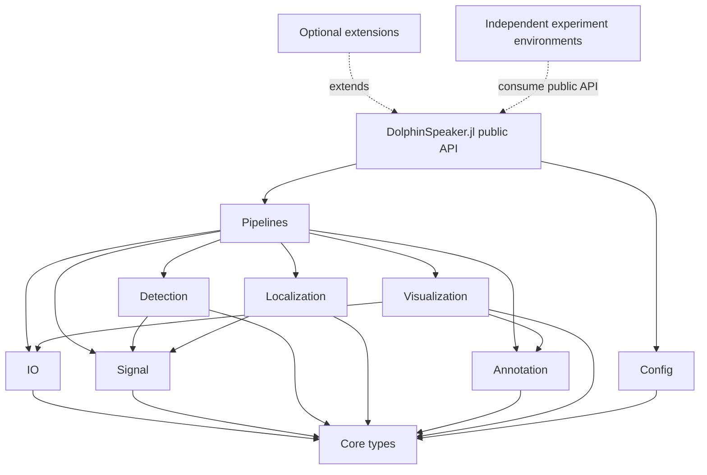

# Proposed repository map

The target is a single small Julia package with explicit configuration and
optional, isolated experiment environments. This is an incremental destination,
not a proposal to move every file at once.

## Target layout

```text
DolphinSpeaker.jl/
├── Project.toml
├── README.md
├── LICENSE / NOTICE                 # finalized only after provenance review
├── src/
│   ├── DolphinSpeaker.jl             # sole include coordinator and public API
│   ├── Core/
│   │   └── Types.jl                  # shared stable data structures
│   ├── Config/
│   │   ├── ProcessingConfig.jl       # explicit immutable run settings
│   │   └── Devices.jl                # named device preset constructors
│   ├── IO/
│   │   ├── Audio.jl
│   │   ├── Media.jl
│   │   └── Metadata.jl
│   ├── Signal/
│   │   ├── DSP.jl
│   │   └── Synchronization.jl
│   ├── Detection/
│   │   ├── Common.jl
│   │   ├── Impulsive.jl
│   │   ├── Tonal.jl
│   │   ├── Band.jl
│   │   └── ClickTrain.jl
│   ├── Localization/
│   │   ├── TDOA.jl
│   │   ├── Geometry.jl
│   │   └── Camera.jl
│   ├── Annotation/
│   │   ├── Audacity.jl
│   │   └── Raven.jl
│   ├── Visualization/
│   │   ├── Plotting.jl
│   │   ├── VideoOverlay.jl
│   │   ├── Spectrogram.jl
│   │   └── Beampattern.jl
│   └── Pipelines/
│       ├── SingleRecording.jl
│       └── ContiguousFolder.jl
├── ext/                               # optional Julia package extensions
│   └── DolphinSpeakerPythonExt.jl     # only if core truly needs integration
├── test/
│   ├── runtests.jl
│   ├── unit/
│   ├── integration/
│   └── fixtures/                      # tiny, asserted, documented provenance
├── docs/
│   ├── Project.toml
│   ├── make.jl
│   └── src/
│       ├── index.md
│       ├── usage.md
│       ├── configuration.md
│       ├── algorithms.md
│       └── api.md
├── examples/                          # safe, bounded, user-editable recipes
├── scripts/                           # parameterized batch/CLI entry points
├── experiments/
│   ├── clustering/
│   │   ├── Project.toml
│   │   ├── Manifest.toml
│   │   └── src-or-notebooks/
│   ├── pinn/
│   │   ├── Project.toml
│   │   ├── Manifest.toml
│   │   └── src-or-notebooks/
│   └── field_analysis/
│       └── ...
├── environments/
│   └── legacy-2025-07-28/
│       ├── Project.toml
│       ├── Manifest.toml
│       └── README.md
└── reviews/                            # this audit and future decisions
```

An `archive/` directory is optional. Prefer tagged Git history for obsolete code;
use an archive only where a runnable historical environment or research record
has value that a commit alone does not explain.

## Target dependency direction



Rules enforced by this map:

1. The root module includes each production file exactly once in dependency
   order.
2. Internal files never call `include`.
3. Lower layers do not depend on pipelines or visualization.
4. Configuration is data passed across boundaries, not ambient global state.
5. Experiments consume the public package API; their dependencies do not leak
   into the core environment.
6. External processes and GPU/Python operations occur only through explicit
   functions with arguments, timeouts, failure propagation, and opt-in calls.

## Public API shape

The eventual API can remain compact even if internal modules are numerous:

```julia
device = dolphin_device(:d3)
config = ProcessingConfig(device=device, detector=:impulsive)

events = detect(recording, config)
localized = localize(events, recording, config)
write_annotations("detections.txt", localized; format=:audacity)

run_contiguous_folder(input_dir, output_dir, config;
                      make_video=true, timeout=Minute(30))
```

The exact names should follow characterization, but the contracts matter:
configuration and I/O are explicit, pipelines return structured results, and
side effects happen only when requested.

## How current material maps to the target

| Current area | Target |
|---|---|
| `audio.jl`, `media_info.jl` | `IO/` |
| `dsp.jl`, `synchronization.jl` | `Signal/` |
| `detector*.jl` | `Detection/` after tonal consolidation |
| `localization.jl`, camera files | `Localization/` |
| `audacity.jl`, `raven.jl` | `Annotation/` |
| `plotting.jl`, `video.jl`, `beampattern.jl`, `pic2vid.jl` | `Visualization/` |
| `run_example.jl`, production parts of `test_run.jl` | `Pipelines/` |
| device setters in `config.jl` | constructors in `Config/Devices.jl` |
| analysis/dev/scratch/temp scripts | `experiments/` or `scripts/` |
| PINN and clustering/cuML | separate `experiments/*` environments |
| dated Project/Manifest files | `environments/legacy-*` or Git tag |
| PkgTemplates source/templates/tests/docs | removed and replaced |

## What should not change during the first move

- Numerical detector thresholds and signal-processing behavior.
- Device preset values.
- Output file formats consumed by Audacity/Raven or existing analysis.
- Time coordinate, channel, and localization conventions.
- Scientific outputs under `results/` or `temp/` without a separate provenance
  decision.

The first structural migration should be semantics-preserving. Algorithm changes
belong in later, independently reviewed changes with fixtures and before/after
evidence.
